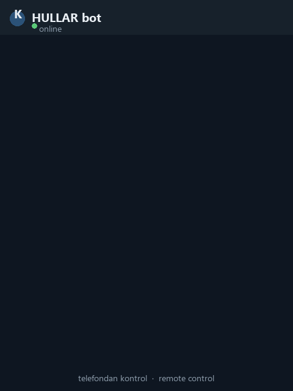

<div align="center">

# 🤖 HULLAR

**Control your Windows PC from anywhere — through Telegram, in your own language.**

*Telefonundan, kendi dilinde Windows bilgisayarını yöneten akıllı asistan.*

[](https://www.python.org/)
[](https://www.microsoft.com/windows)
[](#-features)
[](#-ai-backends)
[](LICENSE)
[](#-multi-language)

<br>



</div>

---

## 📖 What is HULLAR?

HULLAR is a **remote-control assistant** for Windows. You send it a message on Telegram
(or type in CMD) — in **plain, even broken, language** — and it does the job on your PC:
takes a screenshot, opens apps, sets the volume, reports system status, downloads files,
watches your screen, automates games, runs multi-step tasks, and **288+ more skills**.

It understands natural language through a **3-layer smart router** and can *actually see your
screen* using local vision models. It runs **fully offline** with Ollama, or you can plug in
**Google Gemini, Anthropic Claude, OpenAI, or OpenRouter**.

> 🛰️ Designed as a **phone-controlled remote bot** — manage your computer from anywhere.

---

## ✨ Features

| Category | Examples |
|----------|----------|
| 🖥️ **Screen & Camera** | live screen, screenshot, screen recording, webcam photo, OCR read |
| 💻 **System** | battery, CPU/RAM/disk, full health report, IP, Wi-Fi password |
| 🔌 **Power** | lock, sleep, shutdown *(with confirmation)*, restart, Wake-on-LAN |
| 🔊 **Sound & Media** | absolute/relative volume, mute, Spotify, YouTube |
| 🌐 **Internet** | speed test, location, currency & crypto prices, weather, search |
| 🎮 **Automation** | mouse/keyboard control, smart-click by on-screen text, macros |
| 👁️ **Vision** | *describe my screen*, *look at the screen and click Play*, **play games by vision** |
| 🤖 **Agent** | multi-step tasks — *"build an HTML calculator on the desktop"* → writes & runs it |
| 🧠 **Smart** | custom commands / scenes, smart-home webhooks, scheduled reminders |
| 📱 **Remote** | `status` (screen + system), `download <link>`, **voice replies**, send files |
| 🔋 **Proactive** | battery-threshold alerts, intrusion detection, screen watcher |

…and many more. Type `/skills` in the bot for the full, example-rich list.

---

## 🚀 Quick Start

### 1. Requirements
- **Windows 10/11** & **Python 3.10+**
- Optional but recommended:
  - [**Ollama**](https://ollama.com) — free local AI (no API key needed)
  - [**Tesseract OCR**](https://github.com/UB-Mannheim/tesseract/wiki) — for reading on-screen text
  - **ffmpeg** — for voice messages / recording

### 2. Install
```bash
git clone https://github.com/<your-username>/hullar.git
cd hullar
python -m venv venv
venv\Scripts\activate
pip install -r requirements.txt
```

### 3. Configure (interactive wizard) ⭐
```bash
python setup.py
```
The wizard asks — **in your chosen language** — which AI to use, your API key/model,
and your Telegram bot token. It writes `.env` and `data/telegram.json` for you.

> 💡 No wizard? Copy `.env.example` → `.env` and fill it in manually.

### 4. Run
```bash
python -m hullar telegram      # Telegram bot
python -m hullar               # interactive CMD
python -m hullar "battery"     # single command
```

---

## 🌍 Multi-Language

Pick one of **5 languages** during setup (more can be added):

🇹🇷 Türkçe · 🇬🇧 English · 🇩🇪 Deutsch · 🇪🇸 Español · 🇫🇷 Français

When a non-Turkish language is selected, incoming messages are auto-translated for command
matching and replies are translated back — powered by your chosen AI backend.
(`HULLAR_LANG=tr` is a no-op, so Turkish users get zero overhead.)

---

## 🧠 AI Backends

Choose any one in the setup wizard:

| Backend | Cost | Notes |
|---------|------|-------|
| **Ollama** | Free / offline | Recommended. Runs locally (chat, coder, vision models) |
| **Google Gemini** | API key | Fast, capable |
| **Anthropic Claude** | API key | High quality |
| **OpenAI** | API key | GPT models |
| **OpenRouter** | API key | One key, many models |

If the selected backend fails (quota/error), HULLAR automatically falls back to the others.

### How routing works (3 layers)
```
Your message
   │
   ├─ 1. Custom commands / scenes      (instant)
   ├─ 2. Regex rules — 288 skills      (instant, free, typo-tolerant)
   ├─ 3. AI normalize (broken language → clean command)
   └─ 4. AI agent / code generation    (hard, multi-step tasks)
```
Most commands resolve **instantly with regex** — the AI is only used when needed.

---

## 💬 Usage Examples

```
battery                          → 🔋 87% (not charging)
open youtube                     → opens YouTube
set volume to 50                 → sets volume to exactly 50%
status                           → screenshot + full system status
download https://...             → downloads the file and sends it to you
voice battery                    → replies with a VOICE message
look at the screen and click Play
build an html calculator on the desktop   → agent writes & opens it
shutdown                         → ⚠️ asks "are you sure? yes/no"
```

---

## 🔒 Security & Safety

HULLAR controls your real computer. It is built with hard safety boundaries:

- 🔑 **Secrets never leave your machine.** `.env` and `data/telegram.json` are git-ignored.
  Run a scan before publishing — there are **no hardcoded keys** in the code.
- 💳 **No automatic payments.** For ordering features, HULLAR fills the cart but the final
  **"Pay" button always stays with you**. It never enters card details.
- ⚠️ **Irreversible actions require confirmation** (shutdown, restart, empty recycle bin).
- 🔐 Telegram access is **restricted to your own chat ID**.

> **Disclaimer:** This software can fully control your PC. Use it only on machines you own,
> keep your bot token private, and run at your own risk. Not affiliated with any third party.

---

## 🗂️ Project Structure
```
hullar/
├── setup.py            # setup wizard (5 languages + AI backend chooser)
├── hullar/               # entry point, CLI, Telegram bot
├── actions/              # 288+ skills + dispatcher (the "brain")
│   ├── dispatcher.py     # regex router + 3-layer routing
│   ├── ai_skills.py      # AI backends (Ollama/Gemini/Claude/OpenAI/OpenRouter)
│   ├── vision_agent.py   # screen vision + play-by-vision
│   ├── ajan.py           # multi-step task agent
│   └── ...
├── data/                 # config & runtime files (git-ignored)
├── requirements.txt
└── .env.example            # config template
```

---

## 🤝 Contributing
Issues and PRs are welcome. Adding a skill is usually: write a function, add one regex rule
to `actions/dispatcher.py`. Keep rules **typo- and suffix-tolerant**.

## 💛 Support / Destek
HULLAR is free and open-source, built in my spare time. If it helps you, a ⭐ on the repo
means a lot — and sharing it helps even more!

*HULLAR ücretsiz ve açık kaynak. İşine yaradıysa repoya ⭐ vermen ve paylaşman çok değerli!*

## 📜 License
[MIT](LICENSE) — free to use, modify, and share.
